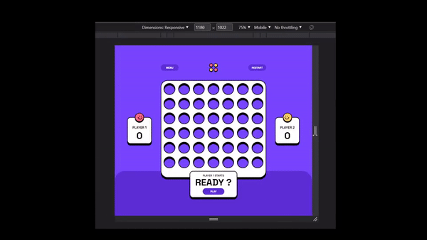

Live site:https://mohamedwael257.github.io/Connect-Four-Game/


# Frontend Mentor - Connect Four game solution

This is a solution to the [Connect Four game challenge on Frontend Mentor](https://www.frontendmentor.io/challenges/connect-four-game-6G8QVH923s). Frontend Mentor challenges help you improve your coding skills by building realistic projects. 

## Table of contents

- [The challenge](#the-challenge)
- [My process](#my-process)
  - [Built with](#built-with)
  - [What I learned](#what-i-learned)
  - [Continued development](#continued-development)
- [Author](#author)

## The challenge

Users should be able to:

- View the game rules
- Play a game of Connect Four against another human player (alternating turns on the same computer)
- View the optimal layout for the interface depending on their device's screen size
- See hover and focus states for all interactive elements on the page
- See the discs animate into their position when a move is made
- Play against the computer
- Control the game with keyboard (Arrow keys and SpaceBar)

## My process

### Built with

- Object Oriented JavaScript
- CSS components workflow
- Flexbox

### What I learned

I experimented displaying game data with pseudo elements `content` property, allowing simpler markup and CSS selectors controlling content format.
```css
body[data-player='2'] .timer:before {
  content: 'Player 2\'s turn';
}
body[data-pvc][data-player='2'] .timer:before {
  content: 'CPU\'s turn';
}
.timer:after {
  content: attr(data-value) 's';
}
```
```html
<button class="btn-play | game-btn">Play</button>
```
```css
body[data-state='end'] .btn-play:after {
  content: ' Again';
}
```

The project included 3 distinct layouts, the grid had to keep an aspect-ratio and all the UI should fit in 100% of the height unlike usual webpages.
The game should perfectly fit any viewport above `360x580`. 
```css
@media (max-aspect-ratio: 840 / 580) and (max-width: 1079px) {
  @media (max-width: 559px), (max-height: 859px) {
    @media (max-width: 380px) and (max-height: 663px) {
    }
    @media (min-width: 381px), (min-height: 664px) {
    }
  }
  @media (min-width: 560px) and (min-height: 860px) {
  }
}
@media not all and (max-aspect-ratio: 840 / 580), (min-width: 1080px) {
}
```
Future media queries will make this much simpler:
```css
@when (aspect-ratio <= 840 / 580) and (width <= 1079px) {
  @when (width <= 559px), (height <= 859px) {
    @when (width <= 380px) and (height <= 663px) {
    }
    @else {
    }
  }
  @else {
  }
}
@else {
}
```
Flexbox was very handy for resizing UI proportionally on different viewports.
`flex-basis` is easier to implement from figma, more explicit and accurate than `height%`.
```css
.game__header {
  flex-basis: 40px;
}
.scores {
  flex-basis: 81px;
}
.grid {
  flex-shrink: 0;
}
```
An other tool for supporting different viewports was `clamp()`.
Let's say I wanted a `font-size` to progressively reduce from 56px at `viewport height = 880px` to 32px at `viewport height = 580px`.
You can calculate the linear equation from 2 points (880, 56) and (580, 32) with the formula or an online calculator and get the result in `vh + px` format.
```css
font-size: clamp(32px, calc(20vh - 88px), 56px);
```



It was also a good opportunity to use `min()` instead of `height` and `min-height`.
```css
.game__wrapper {
  height: min(807px, calc(100% - 20px));
  aspect-ratio: 632 / 807;
}
```

I used the combination of `margin-inline-start` and `direction` to make my CSS less redundant.
```css
.score {
  margin-inline-start: 24px;
}
.score2 {
  direction: rtl;
}
```

I used `:is()` to make some selectors shorter.
```css
:is(body:not([data-state='playing']), body[data-dropping]) .column--selected:before  {
  opacity: 0;
}
```

I used `:where()` to impose a low specifity.
The same `.info` element is used for text before game starts and after game ends.
```css
body[data-state="start"] .info:before {
  content: 'Player 1 starts';
}
body:where([data-pvc][data-player="2"]) .info:before {
  content: 'CPU';
}
```

### Continued development

The current "CPU Opponent" only has a basic defensive strategy. Advanced algorithm for perfect play exists but would leave no chance for the player. Maybe we could have a submenu for CPU strength selection "Easy, Medium, Hard".

Having the game work with a shareable link to play Online PVP could be interesting!
We could use the same submenu to select either "Local PVP" or "Online PVP".


